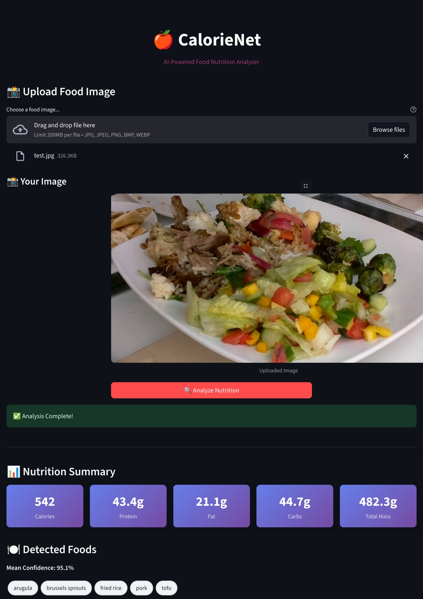

# dish2calories

**dish2calories** is a reimplementation of the **Nutrition5k** dataset and model, designed to estimate the nutritional content of a dish (calories, protein, fat, carbohydrates, and mass) from a single image.  
It combines **multi-label ingredient classification** with **mass regression**, leveraging a deep learning model built on an **EfficientNet-B0 backbone**.


---

<p align="center">
  
</p>

---


## 📌 Overview
The project uses a **multi-task learning** approach to:

- **Classify Ingredients**: Identify which ingredients are present in a dish image.
- **Predict Mass**: Estimate the total dish mass (in grams).
- **Calculate Nutrition**: Combine predictions with per-gram nutritional data to compute:
  - Total Calories  
  - Protein  
  - Fat  
  - Carbohydrates  

The model is served via:
- **FastAPI** (`inference.py`) → for programmatic inference.
- **Streamlit** (`app.py`) → for interactive user-friendly UI.  
- **Docker** → for portable and easy deployment.

---

## 📊 Dataset
The model is trained on the **Nutrition5k dataset**, which includes:

- **5000 unique dishes**, each with ~16 images from alternating angles.
- **Directory structure**: Images grouped by dish ID.
- **Metadata**: CSVs with nutritional info (calories, protein, fat, carbs, and mass).

**Sources**:
- [Kaggle: Nutrition5k Dataset (Side-Angle Images)](https://www.kaggle.com)
- [GitHub: Nutrition5k Full Dataset](https://github.com)

---

## 🏗 Model Architecture

### 🔹 Google Baseline (Nutrition5k Original)
- **Backbone**: InceptionV2 pretrained on **JFT-300M** (~300M images, 18k classes, closed-source).  
- **Input**: 256×256 images, downsized & center-cropped.  
- **Optimization**: RMSProp (lr=1e-4, momentum=0.9, decay=0.9, epsilon=1.0).  
- **Multi-task heads**:
  - Shared 4096-dense layers.
  - Regression heads for calories, macronutrients, and mass.

### 🔹 Our Implementation (CalorieNet)
- **Backbone**: EfficientNet-B0 (ImageNet-pretrained).  
- **Input**: 256×256 images (normalized).  
- **Multi-task heads**:
  - **Classification Head**: Multi-label ingredient classification.
  - **Regression Head**: Mass prediction (grams) via 2-layer MLP (hidden_dim=64, dropout=0.3).
- **Mass Scaling**: `StandardScaler` normalization.  
- **Loss Function**:
  - BCEWithLogitsLoss → classification.  
  - MAE (L1) → regression.  
  - Weighted combination with **uncertainty weighting** ([Kendall et al., 2017](https://arxiv.org/abs/1705.07115)).

---

## 📈 Results

| Method / Metric        | Calories MAE | Mass MAE | Fat MAE | Carb MAE | Protein MAE | Accuracy | Precision | Recall | F1   |
|------------------------|--------------|----------|---------|----------|-------------|----------|-----------|--------|------|
| Google (Portion Indep) | 24.1         | -        | 2.3     | 2.7      | 2.2         | -        | -         | -      | -    |
| Google (Direct)        | 70.6         | 40.4     | 5.0     | 6.1      | 5.5         | -        | -         | -      | -    |
| Ours (Direct)          | 67.66        | 28.56    | 4.61    | 6.41     | 4.52        | -        | -         | -      | -    |
| Ours (Portion Indep)   | 56.12        | -        | 4.04    | 4.79     | 3.94        | -        | -         | -      | -    |
| Ours (Multi-label)     | -            | -        | -       | -        | -           | 0.8754   | 0.9614    | 0.9503 | 0.9558 |

---

## 🔍 What Does the Model Do?
The dish2calories model's methodology enhances interpretability through transparent ingredient classification, mass regression, and nutritional calculations, while being more lightweight than Google's baseline by using EfficientNet-B0 and only two task heads (classification and regression) compared to Google's four.
The classification head takes the features from EfficientNet-B0 and predicts which ingredients are present.  
This is a multi-label classification task, meaning the model can predict multiple ingredients at once (e.g., a dish might have chicken and rice).  

The regression head also uses the features from EfficientNet-B0 to predict the total mass of the dish in grams.  

The model uses a table called norm_ingr, which lists the nutritional content per gram for each ingredient. For example:
- Chicken: 1.65g protein, 0.3g fat, 0g carbs per gram.  
- Rice: 0.07g protein, 0.01g fat, 0.28g carbs per gram.  

The model calculates the per-gram nutrition of the dish by combining the predicted ingredients. There are two ways it can do this:  
- **Binary Mode**: If an ingredient is predicted (e.g., chicken and rice), it takes the average of their per-gram nutrition.  
- **Probabilistic Mode**: Uses the confidence scores (e.g., 80% chicken, 60% rice) to weigh the contribution of each ingredient’s nutrition. Higher-confidence ingredients contribute more to the average.  

For example, if the dish is predicted to have chicken and rice, the per-gram nutrition might be:  
- Protein: (1.65 + 0.07) / 2 = 0.86g per gram (in binary mode).  
- Fat: (0.3 + 0.01) / 2 = 0.155g per gram.  
- Carbs: (0 + 0.28) / 2 = 0.14g per gram.  

The total nutrition is calculated by multiplying the per-gram values by the predicted mass:  
- If mass = 200g:  
  - Total protein = 0.86 × 200 = 172g.  
  - Total fat = 0.155 × 200 = 31g.  
  - Total carbs = 0.14 × 200 = 28g.  

Calories are calculated using the standard formula:  
- Calories = (4 × protein) + (9 × fat) + (4 × carbs).  
- Using the example above:  
  - Calories = (4 × 172) + (9 × 31) + (4 × 28) = 688 + 279 + 112 = 1079 calories.  

**Output Example**  
The model returns a dictionary with:
- Total Protein: e.g., 172g.  
- Total Fat: e.g., 31g.  
- Total Carbs: e.g., 28g.  
- Total Calories: e.g., 1079 calories.  
- Total Mass: e.g., 200g.  
- Labels: List of detected ingredients (e.g., ["chicken", "rice"]).  
- Confidence Scores: How sure the model is about each ingredient (e.g., [0.8, 0.6]).  
- Mean Confidence: Average confidence across detected ingredients.  

For a single image, this is returned via the FastAPI endpoint or displayed in the Streamlit UI.  

---

## ⚙️ Installation & Usage

### 🔹 Clone Repository
```bash
git clone <repository-url>
cd dish2calories
````

### 🔹 Docker Setup

1. **Build**

```bash
docker build -t dish2calories .
```

2. **Run (with GPU support)**

```bash
docker run -it --gpus all -p 8000:8000 -p 8501:8501 dish2calories bash
```

3. **Inside container**

```bash
# Start FastAPI
python inference.py  

# Start Streamlit UI
streamlit run app.py --server.port=8501 --server.address=0.0.0.0
```

* FastAPI: [http://localhost:8000](http://localhost:8000)
* Streamlit: [http://localhost:8501](http://localhost:8501)

### 🔹 Running Locally (Without Docker)

```bash
# Install PyTorch → https://pytorch.org/get-started/locally/
pip install -r requirements.txt

# Start FastAPI
python inference.py

# Start Streamlit
streamlit run app.py
```

---

## 📚 References

* Nutrition5k Paper: [arXiv:2103.03375](https://arxiv.org/abs/2103.03375)
* Multi-task Loss: [arXiv:1705.07115](https://arxiv.org/abs/1705.07115)
* Blog: *Predicting Nutritional Contents of Meals Using Deep Learning*
* Dataset: [Kaggle: Nutrition5k](https://www.kaggle.com) | [GitHub: Nutrition5k](https://github.com)

---

## 📜 License

This project is licensed under the **MIT License**.
See the [LICENSE](LICENSE) file for details.


